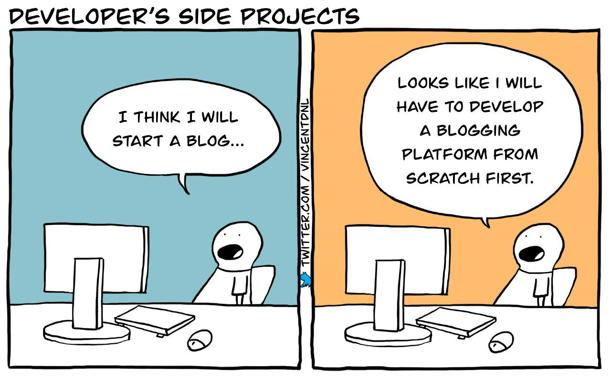

Hi, I'm Mattias! Somehow you found my personal blog, well done. This is where I post my thoughts and ramblings about everything that interests me.

## About me

I'm a software engineer from Belgium. I work mainly with web technologies such as HTML, CSS and JavaScript/TypeScript.

In my day job, I work at Dolby × THEO where I develop solutions for online video streaming such as [THEOplayer](https://www.theoplayer.com/). In my free time, I work on web standards such as [the Streams standard](https://streams.spec.whatwg.org/), and I maintain various open-source projects such as [web&#8209;streams&#8209;polyfill](https://github.com/MattiasBuelens/web-streams-polyfill) and [wasm&#8209;streams](https://github.com/MattiasBuelens/wasm-streams/). Sometimes I do weird experiments, such as [building an HTML `<video>` element from scratch](https://github.com/MattiasBuelens/baby-video) or [making streams work across web workers](https://github.com/MattiasBuelens/remote-web-streams).

## Talks

I've done two talks so far. I'll try to find some time to do a proper write-up of my talks on this blog ...someday.

- [Demuxed 2022: Baby's first HTML5 video element](https://www.youtube.com/watch?v=OBhlTcllq_E&list=PLkyaYNWEKcOf98lZxnCcL6y7ZIVU3oSYO&index=7)
- [Demuxed 2023: The curious player of Benjamin Button: reverse video on the web](https://www.youtube.com/watch?v=0sYeEpR10sY&list=PLkyaYNWEKcOesxC4VpHJtbjnzuN6r1NGg&index=15)

## Tech stack

It's been a while since I made a full website from scratch, so I wanted to experiment with some fancy new web technologies. So obviously, I fell into the age-old trap of endlessly fiddling with the tech stack of my blog before I actually started _writing_ some content. 😅

<figure>

<figcaption>

_Comic by [Vincent Déniel](https://x.com/vincentdnl/status/1672280869673873419)_

</figcaption>
</figure>

Anyway, here's what I'm currently using:

- I use [SvelteKit](https://svelte.dev/docs/kit/) for the app framework. I love how Svelte lets you write components with (mostly) plain HTML, CSS and JavaScript, and then compose and re-use them however you like. SvelteKit's path-based routing is also excellent, and I actually _like_ how server-only code must live in a separate `+server` file (instead of sprinkling `"use server"` directives around). Also, lots of ❤️️ for [Rollup](https://rollupjs.org/) and [Vite](https://vite.dev/)!
- I started from [Matt Jennings](https://mattjennings.io/)' excellent [SvelteKit blog template](https://github.com/mattjennings/sveltekit-blog-template). I'm not a great designer myself, so having a solid design to start from really helped. I refactored all JavaScript code to TypeScript, and updated everything to SvelteKit 2 and Svelte 6.

[The entire website lives on GitHub](https://github.com/MattiasBuelens/website). Feel free to look around, send pull requests to fix typos, or use it as the template for your own blog.

## Thanks for visiting!

If you like this sort of thing, follow me on my socials down below. See you around!
